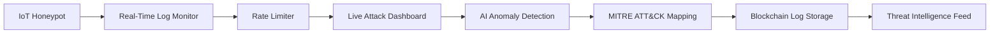

IoT Security Honeypot & Threat Detection System

[IoT Security](https://img.shields.io/badge/IoT-Security-blue) [Python](https://img.shields.io/badge/Python-3.8%2B-green) [MITRE ATT&CK](https://img.shields.io/badge/MITRE-ATT%26CK-red)  

A real-time IoT security monitoring system that simulates attacks, detects anomalies, and integrates advanced cybersecurity mechanisms like **AI-powered threat detection, blockchain-based tamper-proof logs, and MITRE ATT&CK mapping**.  

---

📌 Key Features  

✅ IoT Honeypot – Simulates vulnerable devices to attract & analyze attacks.  
✅ Real-Time Log Monitoring – Live tracking of malicious activities.  
✅ Rate Limiter – Blocks brute-force attacks by limiting login attempts.  
✅ Live Attack Dashboard – Visualizes threats using **Matplotlib**.  
✅ AI-Powered Anomaly Detection – Uses **Isolation Forest & Autoencoders** to detect zero-day attacks.  
✅ MITRE ATT&CK Framework Mapping – Classifies attacks using globally recognized tactics.  
✅ Blockchain for Tamper-Proof Logs – Ensures log integrity with **SHA-256 hashing**.  
✅ Threat Intelligence Feed – Cross-references logs with **AlienVault OTX** for known malicious IPs.  

---

🚀 Quick Start

Prerequisites 
- Python 3.8+  
- Libraries: `tensorflow`, `scikit-learn`, `pandas`, `matplotlib`, `requests`  

### **Installation**  
```bash
git clone https://github.com/yourusername/iot-security-honeypot.git
cd iot-security-honeypot
pip install -r requirements.txt
```

### **Run the Honeypot**  
```bash
python honeypot.py
```

### **Simulate an Attacker**  
```bash
python attacker_simulation.py
```

### **View Attack Logs**  
```bash
python view_logs.py
```

### **Launch AI Anomaly Detection Dashboard**  
```bash
python anomaly_detection.py
```

---

## **📊 System Architecture**  



---

## **🔍 Example Outputs**  

### **1. Attack Logs**  
```
[2025-03-28 14:39:31] Attack from 127.0.0.1 | Password tried: 'admin'
[2025-03-28 14:39:32] Attack from 192.168.1.1 | Password tried: 'password'
```

### **2. AI Anomaly Detection**  
  

### **3. MITRE ATT&CK Mapped Threats**  
| IP             | Attack Type        | MITRE Tactic |
|----------------|--------------------|--------------|
| 192.168.1.1    | Brute-Force        | T1110        |
| 10.0.0.5       | Port Scanning      | T1595        |

---

## **🛡️ Use Cases**  
- **Security Research** – Analyze real-world attack patterns.  
- **Threat Intelligence** – Detect & block malicious IPs.  
- **Incident Response** – Rapidly identify breaches.  
- **Compliance Auditing** – Maintain immutable logs for regulations.  

---

## **📜 License**  
MIT License – Free for research and commercial use.  

---

## **📬 Contact**  
For questions or contributions:  
📧 Email: your.email@example.com  
🐦 Twitter: [@YourHandle](https://twitter.com/YourHandle)  

---

**🌟 Star this repo if you find it useful!**  
**🔗 Share with your network to help improve IoT security.**  

[](https://github.com/yourusername/iot-security-honeypot)  

--- 

### **🔜 Future Work**  
- [ ] Deploy as a **cloud-based SaaS** (AWS/GCP).  
- [ ] Add **React.js frontend** for interactive dashboards.  
- [ ] Integrate **SIEM tools** (Splunk, ELK Stack).  

**Contributions welcome!** 🚀  

--- 

**🔐 Secure the IoT, one device at a time.**
